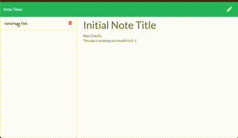

# JY Note Taker

## Description
This application can be used to create, view and delete Notes.  It will use backend NodeJS API handling, and front end JS, CSS, HTML and be hosted as an Express app on Heroku
## Table of Contents
* [`Project`](#)
* [`Description`](#Description)
* [`Table of Contents`](#Table-of-Contents)
* [`1nstallation Steps`](#Installation-Steps)
* [`Usage Information`](#Usage-Information)
* [`Testing`](#Testing)
* [`License`](#License)
* [`Contributing`](#Contributing)
* [`Questions`](#Questions)
* [`Sample`](#Sample)
## Installation Steps
To install this project, do the following:
> 1. In terminal/command shell: run "heroku --version" to ensure you have heroku installed
> 2. Clone git repository to local directory.
> 3. In terminal/command shell: browse to root project directory.
> 4. Run "npm install"
> 5. Run "heroku login"
> 6. In the browser window that pops up: login to your heroku account.
> 7. In terminal/command shell: run "heroku create"
> 8. Verify ready to push to heroku by running "git remote -v"
> 9. Run "git push heroku master"
> 10. Login to your heroku account in browser and verify app recently pushed/updated.

## Usage Information
To use this project, do the following:
> 1. Ensure installation steps have been completed.
> 2. In heroku app page: click settings tab and scroll down to "Domains" section
> 3. Copy and paste URL into browser address bar to access deplyed app.

## Testing
To test this project, do the following:
> 1. Ensure Installation & Usage steps are complete
> 2. Click the "Get Started" Button in the browser home page.
> 3. In the Notes Page: the left side of the screen shows saved notes, click on one to display the details of the note in the main section.
> 4. To delete a saved note click the "garbage" icon next to the saved note.
> 5. To create a new note click the "pencil" icon in the top right corner to enable the main area to be editable.
> 6. To save the new note click the "save" icon in the top right area.
> 7. To return to the home page click the "Note Taker" heading in the top left area.

## License
This project is provided under the None license. For more information on license details click here 
## Contributing
If you wish to contribute, do the following:
> Email directly or submit pull requests to contribute.
## Questions
If you have any question about this repo, you may open an issue or contact me directly at jyoung7223@yahoo.com
You can find more of my work at [My Github Repo](https://github.com/JYoung7223 "My GitHub Repo")
## Sample
Deployed project can be found at: https://evening-shore-95662.herokuapp.com/

Below is a sample screenshot:

